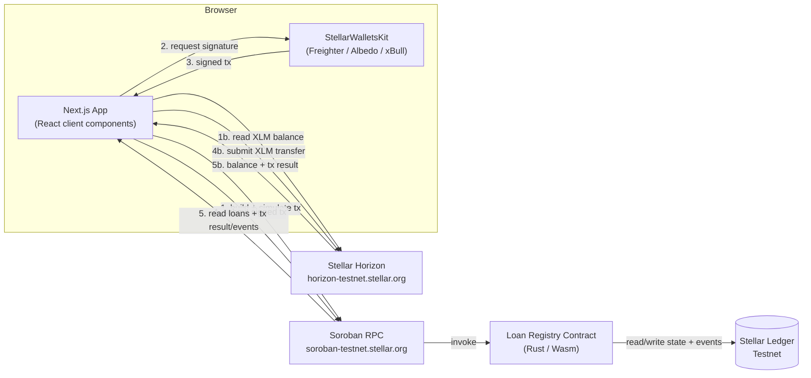

<div align="center">

# P2P

**Peer-to-peer lending, powered by Stellar.**

[](https://soroban.stellar.org)
[](https://stellar.org)
[](https://nextjs.org)
[](#-license)

[Contract Address](#-contract-address--explorer) · [Features](#-features) · [Architecture](#-architecture) · [Getting Started](#-getting-started) · [Roadmap](#-roadmap--future-improvements)

</div>

---

## 📌 Overview

P2P is a wallet-connected web application built on Stellar and Soroban,
laying the foundation for a peer-to-peer lending product. Borrower loan
requests are stored as Soroban smart contract state on the **Loan
Registry** contract — every write is a transaction signed by the
borrower's own wallet before it's submitted; there's no admin key and no
privileged account that can create or cancel a loan request on someone
else's behalf.

There is no backend and no database yet. The browser talks directly to
the connected wallet, to Stellar Horizon (for native XLM balance and
transfers), and to Soroban RPC (for Loan Registry contract reads and
writes).

## 🚀 Features

### Currently implemented

- **Multi-wallet connection** — connect and disconnect via
  [Freighter](https://www.freighter.app), [Albedo](https://albedo.link), or
  [xBull](https://xbull.app), through a single "Connect Wallet" button
  backed by StellarWalletsKit. Wallet-not-installed, rejected requests, and
  a wallet on the wrong network are all handled with clear, wallet-accurate
  messaging.
- **XLM balance & transfers** — view the connected account's native XLM
  balance on Stellar Testnet, and send XLM to any Testnet address, with
  destination/amount validation before submission.
- **Permissionless loan requests** — any connected address can create a
  loan request directly against the Loan Registry contract; no allowlist,
  no approval step, no admin gate.
- **On-chain loan state** — a loan request's borrower, amount, and status
  live in Soroban contract state, not a database.
- **Cancel your own loan request** — only the original borrower's wallet
  can cancel a loan request it created; enforced on-chain, not just in the
  UI.
- **Full transaction lifecycle feedback** — every wallet-signed
  transaction (transfer or contract write) walks through preparing →
  awaiting a wallet signature → submitted/pending → confirmed (with
  transaction hash) or failed/rejected, using one reusable status
  component. A transaction hash is only ever shown once the transaction is
  actually confirmed on-chain.
- **Soroban contract events, no polling** — the Loan Registry contract
  emits a `created` event (loan id, amount) on loan creation and a
  `cancelled` event (loan id) on cancellation. The frontend decodes these
  directly from the confirmed transaction's own result data and uses them
  to keep the open Loan Lookup panel in sync automatically.
- **Centralized, safe error handling** — technical errors from the
  wallet, the network, Horizon, or Soroban RPC are mapped through shared
  modules into clear, safe, user-facing messages; raw technical details
  are never rendered in the UI.

### Not yet implemented

This release is a wallet, XLM-transfer, and first-contract foundation —
not the full lending product. Lender funding, interest terms, repayment,
collateral, and reputation/risk scoring are **not** in the current
contract or UI. They're tracked honestly in
[Roadmap](#-roadmap--future-improvements) rather than claimed here.

## 🖼️ Screenshots

No screenshots are included in this repository yet. The application is a
three-section dashboard (Dashboard, Loan Registry, Wallet) reachable by
running the project locally (see [Getting Started](#-getting-started)) and
connecting a Testnet-configured wallet from the header.

## 🏗️ Architecture

There is no backend. The browser talks to the connected wallet, to
Stellar Horizon, and to Soroban RPC directly; the smart contract is the
source of truth for loan-request state.



**Read path:** the UI calls the contract's read-only functions
(`get_loan_count`, `get_loan_request`) through the RPC's simulation
endpoint — no signature or fee required. XLM balance is read the same way
via Horizon's REST API.

**Write path:** the UI builds a transaction invoking `create_loan_request`
or `cancel_loan_request` (or a native XLM payment), simulates it, sends it
to the connected wallet for a signature, then submits the signed
transaction and waits for on-chain confirmation before treating it as
successful. For contract writes, the confirmed transaction's own result
data is then decoded for any Loan Registry event it emitted.

## 📁 Folder Structure

```
p2p/
├── frontend/                          # Next.js frontend (the dApp) — self-contained project
│   ├── src/
│   │   ├── app/                       # App Router: layout, page, styles
│   │   ├── components/
│   │   │   ├── wallet/                # Connect button, balance display, transfer form
│   │   │   ├── transaction/           # Reusable transaction feedback UI
│   │   │   ├── loans/                 # Loan lookup panel, create/cancel actions, status badge
│   │   │   ├── dashboard/             # Dashboard summary cards
│   │   │   ├── layout/                # Sidebar, header, navigation
│   │   │   └── ui/                    # Shared presentational primitives
│   │   ├── hooks/
│   │   │   ├── useWallet.ts           # Wallet connect/disconnect state
│   │   │   ├── useXlmBalance.ts       # XLM balance fetch/refresh state
│   │   │   ├── useTransfer.ts         # XLM transfer lifecycle state
│   │   │   ├── useLoanCount.ts        # Loan Registry read: total loan count
│   │   │   ├── useLoanRequest.ts      # Loan Registry read: single loan request
│   │   │   └── useLoanRegistryWrite.ts # Loan Registry write: create/cancel
│   │   ├── lib/
│   │   │   ├── wallet/                # StellarWalletsKit integration
│   │   │   ├── stellar/               # Horizon calls, XLM transfer, Loan Registry
│   │   │   │                          # service (reads/writes/event decoding)
│   │   │   └── errors/                # Centralized error mapping
│   │   └── config/
│   │       └── stellar.ts             # Centralized Stellar Testnet + contract configuration
│   ├── public/                        # Static assets
│   ├── package.json, tsconfig.json, next.config.ts, eslint.config.mjs
│   └── .env.example                   # Documented environment configuration (no secrets)
│
├── backend/                            # Express/TypeScript API foundation — self-contained project
│   ├── src/
│   │   ├── config/env.ts               # Typed, validated environment configuration
│   │   ├── errors/AppError.ts          # Typed, safe-to-expose application error
│   │   ├── middleware/
│   │   │   ├── errorHandler.ts         # Centralized error-handling middleware + 404 handler
│   │   │   └── validate.ts             # Generic request-validation middleware (Zod)
│   │   ├── routes/health.ts            # GET /health
│   │   ├── app.ts                      # Express app factory (routes + middleware wiring)
│   │   └── server.ts                   # Process entrypoint
│   ├── package.json, tsconfig.json
│   └── .env.example                    # Documented environment configuration (no secrets)
│
├── contracts/                         # Soroban smart contract workspace
│   ├── Cargo.toml                     # Workspace root, soroban-sdk version, release profile
│   ├── loan_registry/
│   │   ├── src/
│   │   │   ├── lib.rs                 # The contract: create_loan_request, cancel_loan_request,
│   │   │   │                          # get_loan_request, get_loan_count
│   │   │   ├── state.rs               # LoanRequest / LoanStatus / DataKey definitions
│   │   │   └── test.rs                # Unit tests using soroban-sdk testutils
│   │   └── Cargo.toml
│   └── scripts/deploy_testnet.sh      # Repeatable Testnet deployment workflow
│
├── docs/
│   └── CURRENT_STATUS.md              # Implementation/verification history and status
│
└── README.md                          # You are here (kept at repo root — GitHub convention)
```

Each of `frontend/`, `backend/`, and `contracts/` is a self-contained
project with its own dependency manifest, config, and `.gitignore` —
commands for each are run from inside that directory (see
[Getting Started](#-getting-started)).

## 🖥️ Backend Foundation

`backend/` is a small, independent Express + TypeScript API. Nothing in
the frontend calls it yet — it exists as the configuration/validation/
error-handling foundation future P2P domain endpoints (loan
funding, indexing, etc.) will be built on, not as a product feature
itself.

Currently implemented:

- **Typed, validated configuration** — every environment variable the
  backend reads is parsed and validated once at startup with Zod; the
  process fails fast with a clear message on invalid config rather than
  limping along with `undefined` values.
- **`GET /health`** — reports status, environment, uptime, and a
  timestamp. Not yet backed by any database or external service, since
  none exist yet.
- **Centralized error handling** — a single Express error-handling
  middleware turns any thrown error into a safe `{ error: { code,
  message } }` JSON response; unexpected errors are logged in full
  server-side but never expose their raw message or stack trace to the
  caller. An unmatched route returns a safe 404 JSON error rather than
  Express's default HTML page.
- **Generic request validation** — a reusable Zod-based middleware for
  validating a request's body/query/params, ready for the first real
  endpoint to use.

No P2P domain logic (loans, users, database) exists in the backend yet
— see [Roadmap](#-roadmap--future-improvements).

## 📜 Smart Contract Overview

The Loan Registry contract (`contracts/loan_registry/src/lib.rs`) is
intentionally small: it records loan requests and nothing else. It has
**no owner, no pause switch, and no upgrade proxy** — every function is
callable by any address, and each write is authorization-checked against
the address it actually affects.

| Function | Description |
|---|---|
| `create_loan_request(borrower, amount) -> Result<u64, Error>` | Creates a new `Open` loan request for `borrower` (requires `borrower`'s authorization), auto-increments the loan id, returns it. |
| `cancel_loan_request(borrower, loan_id) -> Result<(), Error>` | Cancels an `Open` loan request; requires `borrower`'s authorization and that `borrower` is the loan's original owner. |
| `get_loan_request(loan_id) -> Result<LoanRequest, Error>` | Reads a single loan request by id. |
| `get_loan_count() -> u64` | Reads the total number of loan requests ever created. |

**Errors** (`Error`, `#[contracterror]`): `InvalidAmount` (amount was zero
or negative), `LoanNotFound`, `NotLoanOwner` (caller isn't the loan's
borrower), `LoanNotOpen` (e.g. already cancelled).

**Storage layout:**

- `DataKey::LoanCount` → `u64`, instance storage — the number of loan
  requests ever created, and the source of the next loan request's id
- `DataKey::Loan(loan_id)` → `LoanRequest`, persistent storage per loan

**`LoanRequest`**: `borrower`, `amount` (`i128`), `status`
(`LoanStatus::Open` or `LoanStatus::Cancelled`)

**Events:** `create_loan_request` emits `("created", borrower)` with
`(loan_id, amount)` as data; `cancel_loan_request` emits
`("cancelled", borrower)` with `loan_id` as data. Both are published only
on the success path.

Build with the Stellar CLI (not plain `cargo build`):
`stellar contract build`. Verify locally with `cargo test`,
`cargo fmt --check`, and
`cargo clippy --all-targets --all-features -- -D warnings` from
`contracts/`.

## 🧰 Tech Stack

| Layer | Technology |
|---|---|
| Frontend framework | [Next.js 16](https://nextjs.org) (App Router) + [React 19](https://react.dev) |
| Backend framework | [Express 5](https://expressjs.com) + [Zod](https://zod.dev) (validation), TypeScript |
| Language | TypeScript, Rust |
| Blockchain SDK | [`@stellar/stellar-sdk`](https://www.npmjs.com/package/@stellar/stellar-sdk) |
| Wallets | [Freighter](https://www.freighter.app), [Albedo](https://albedo.link), [xBull](https://xbull.app), via [`@creit.tech/stellar-wallets-kit`](https://github.com/Creit-Tech/Stellar-Wallets-Kit) |
| Smart contracts | [Soroban](https://soroban.stellar.org) / [`soroban-sdk`](https://crates.io/crates/soroban-sdk) (Rust, compiled to Wasm) |
| Network | Stellar Testnet — Horizon (`horizon-testnet.stellar.org`) + Soroban RPC (`soroban-testnet.stellar.org`) |
| Testing | Node.js built-in test runner (`node --test`) for frontend and backend; `cargo test` for the contract |

## 🛠️ Getting Started

### Requirements

Node.js ≥ 20, npm, and a Stellar-Testnet-configured wallet browser
extension — [Freighter](https://www.freighter.app), [Albedo](https://albedo.link),
or [xBull](https://xbull.app). A funded Testnet account (use the
[Stellar Testnet Friendbot](https://laboratory.stellar.org/#account-creator?network=test)
to fund a new one). Only if you're touching the contract: a Rust toolchain
with the `wasm32-unknown-unknown` target and the
[Stellar CLI](https://developers.stellar.org/docs/tools/developer-tools/cli/install-cli).

### Installation

```bash
git clone <repository-url>
cd p2p/frontend
npm install
cp .env.example .env.local
```

`.env.example` documents every variable the frontend reads — all public
network configuration, no secrets: the Stellar network name/passphrase,
the Horizon URL, the Soroban RPC URL, and the deployed Loan Registry
contract id (see [Contract Address & Explorer](#-contract-address--explorer)).

### Running locally

```bash
npm run dev
```

Open [http://localhost:3000](http://localhost:3000), connect a wallet set
to Testnet from the header, and use the Dashboard, Loan Registry, or
Wallet sections.

### Building for production

```bash
npm run build
npm run start
```

Verification commands — `npm test` (106/106 passing), `npx tsc --noEmit`,
`npm run lint`, and the contract's `cargo test` (13/13 passing),
`cargo fmt --check`, `cargo clippy --all-targets --all-features -- -D
warnings` — all pass as of this writing. Live wallet-signed contract
writes and live event observation against the deployed Testnet contract
have not yet been captured with evidence; everything above is
build/type/lint/test-level verification.

### Backend development

```bash
cd backend
npm install
cp .env.example .env.local   # optional — sensible defaults apply without it
npm run dev                   # starts the API on http://localhost:4000
```

```bash
npm test              # 17/17 passing
npx tsc --noEmit       # clean
npm run build          # compiles to dist/ (test files excluded)
npm run start           # runs the compiled build
```

`GET http://localhost:4000/health` is the only endpoint so far. It was
verified both by its automated test suite and by a manual live run
(`curl http://localhost:4000/health` against the built server).

## 🚢 Deployment

The frontend is a standard Next.js app and deploys anywhere Next.js does
(e.g. [Vercel](https://vercel.com/new)). The smart contract is deployed
independently via the Stellar CLI:

```bash
cd p2p/contracts/loan_registry
stellar contract build
stellar contract deploy \
  --wasm ../target/wasm32-unknown-unknown/release/loan_registry.wasm \
  --source <your-identity> \
  --network testnet
```

Then point `NEXT_PUBLIC_LOAN_REGISTRY_CONTRACT_ID` in `.env.local` at the
id that command prints. `contracts/scripts/deploy_testnet.sh` wraps a
repeatable version of this workflow and authenticates through the Stellar
CLI's own local identity keystore — never a key committed to a file.

## 🔗 Contract Address & Explorer

| | |
|---|---|
| **Network** | Stellar Testnet |
| **Contract** | `loan_registry` |
| **Contract address** | `CAKENBWT2237ASCTOZMFOMQTYWYRXQRMVX7N2OYGH67P7YMJFOD2L7YA` |
| **Explorer** | [stellar.expert/explorer/testnet/contract/CAKENBWT2237ASCTOZMFOMQTYWYRXQRMVX7N2OYGH67P7YMJFOD2L7YA](https://stellar.expert/explorer/testnet/contract/CAKENBWT2237ASCTOZMFOMQTYWYRXQRMVX7N2OYGH67P7YMJFOD2L7YA) |
| **Deployer address** | `GCCIWTVKZXF4UBD4HOBDUWFQVEFHLH53DL54SUYAQLMYWKHUXTXBCTMF` |
| **Deployment transaction** | [`ad347084a8e63828bd9501cfd75bd4e3ab9c00b29d4557e97b05ff9c66d0e3ed`](https://stellar.expert/explorer/testnet/tx/ad347084a8e63828bd9501cfd75bd4e3ab9c00b29d4557e97b05ff9c66d0e3ed) |

No secret key, seed phrase, or other credential is recorded anywhere in
this repository — only public addresses and public transaction hashes.

## ⚠️ Limitations

- The backend has no database or persistence layer yet, and nothing in
  the frontend calls it — all product state is either on the Stellar
  ledger or held in memory in the browser.
- No transaction history — only the most recent transfer/contract-call
  result is shown per session; nothing is stored between sessions.
- The Loan Registry contract only records loan requests
  (create/cancel) — it does not yet implement lender funding, interest,
  repayment, or collateral.
- `create_loan_request`'s `amount` is currently a whole, unscaled
  integer — provisional pending real asset/funding integration.
- No indexing layer or push-based real-time updates — contract event
  data is decoded only from the caller's own confirmed transaction, not
  observed for other users' activity.
- The live wallet-signed contract-write and event flow has not yet been
  exercised and recorded end-to-end against the deployed Testnet
  contract.

## 🔮 Roadmap / Future Improvements

- **P2P domain expansion** — lender funding, interest terms, and
  repayment on top of the existing Loan Registry contract.
- **Collateral & risk** — collateral locking, loan health, and a
  risk/reputation model.
- **Backend & indexing** — a database, real business endpoints, and an
  event-indexing layer built on the existing configuration/validation/
  error-handling foundation, for real-time, multi-user state
  synchronization beyond a single caller's own transactions.
- **Borrower & lender dashboards** — portfolio views for each side of a
  loan.
- **Transaction history** — a persisted, queryable record of past
  transfers and loan activity.
- **Production deployment** — a hardened, monitored deployment on
  Stellar Mainnet.

## 📄 License

This project is currently unlicensed and intended for development and
demonstration purposes on Stellar Testnet.
