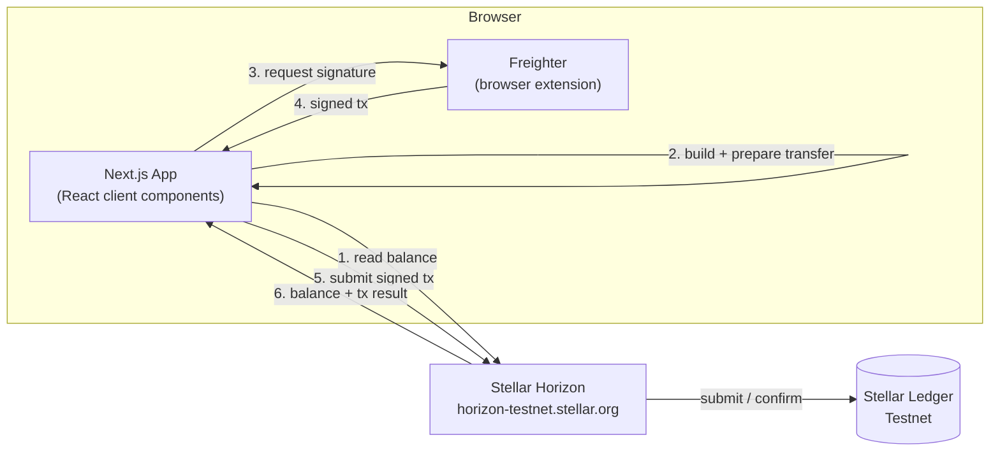

<div align="center">

# P2P

**Peer-to-peer lending, powered by Stellar.**

[](https://nextjs.org)
[](https://stellar.org)
[](https://www.typescriptlang.org)
[](#-verification)

[Features](#-features) · [Architecture](#-architecture) · [Getting Started](#-getting-started) · [Evidence](#-evidence) · [Roadmap](#-roadmap--future-improvements)

</div>

---

## 📌 Overview

P2P is a wallet-connected web application for interacting with the Stellar
network, built as the foundation for a peer-to-peer lending product. This
release covers wallet connectivity, balance visibility, and native XLM
transfers on the **Stellar Testnet**, with a deliberate focus on clear
transaction feedback and safe, predictable error handling — the groundwork
a lending product needs before any lending logic is added.

There is no backend and no database yet. The browser talks directly to the
**Freighter** wallet extension and to the public Stellar Horizon API; every
transfer is a transaction the wallet signs locally before it's submitted.

## 🚀 Features

### Currently implemented

- **Wallet connection** — connect and disconnect a
  [Freighter](https://www.freighter.app) wallet, with clear handling for a
  missing extension, a rejected connection request, and a wallet configured
  on the wrong network.
- **XLM balance** — view the connected account's native XLM balance on
  Stellar Testnet, with loading/error states and a manual refresh control.
- **XLM transfers** — send XLM to any Stellar Testnet address, with
  destination and amount validation before submission.
- **Transaction feedback** — a single, reusable status display walks the
  user through every stage of a transfer: preparing, awaiting a signature
  in Freighter, submitted and awaiting confirmation, confirmed (with the
  transaction hash and a Stellar Testnet Explorer link), or — if something
  goes wrong — a clear distinction between a transaction the user rejected
  and one that failed for another reason.
- **Centralized, safe error handling** — technical errors from the wallet,
  the network, or Stellar itself are mapped through a single module into
  clear, safe, user-facing messages. Raw technical details are never
  rendered in the UI.

### Not yet implemented

This release is a wallet and transaction foundation, not the lending
product itself. Borrower/lender roles, loan creation and funding,
collateral, reputation, multi-wallet support, and any on-chain contract
logic are **not** in the current codebase. They're tracked honestly in
[Roadmap](#-roadmap--future-improvements) rather than claimed here.

## 🖼️ Screenshots

<div align="center">

**Connected wallet**


**XLM balance**


**Successful Testnet transaction**


</div>

## 🏗️ Architecture

There is no backend yet. The browser talks to the wallet extension and to
Stellar Horizon directly.



**Read path:** the UI queries Horizon's REST API directly for account
balance — no signature or fee required.

**Write path:** the UI builds a native XLM payment transaction via the
Stellar SDK, sends it to Freighter for a signature, then submits the
signed transaction to Horizon and waits for confirmation.

## 📁 Folder Structure

```
p2p/
├── src/
│   ├── app/                          # Next.js App Router: layout, page, styles
│   │   ├── layout.tsx
│   │   ├── page.tsx                  # Wallet UI + balance + transfer form
│   │   └── globals.css
│   ├── components/
│   │   ├── wallet/                   # Connect button, balance display, transfer form
│   │   └── transaction/              # Reusable transaction feedback UI
│   ├── hooks/
│   │   ├── useWallet.ts              # Wallet connect/disconnect state
│   │   ├── useXlmBalance.ts          # Balance fetch/refresh state
│   │   └── useTransfer.ts            # Transfer lifecycle state
│   ├── lib/
│   │   ├── wallet/                   # Freighter integration
│   │   ├── stellar/                  # Horizon calls, transaction build/sign/submit
│   │   └── errors/                   # Centralized error mapping
│   └── config/
│       └── stellar.ts                # Centralized Stellar Testnet configuration
├── .env.example                      # Documented environment configuration (no secrets)
└── package.json
```

## 🧰 Tech Stack

| Layer | Technology |
|---|---|
| Frontend framework | [Next.js 16](https://nextjs.org) (App Router) + [React 19](https://react.dev) |
| Language | TypeScript (strict) |
| Blockchain SDK | [`@stellar/stellar-sdk`](https://www.npmjs.com/package/@stellar/stellar-sdk) |
| Wallet | [Freighter](https://www.freighter.app) via `@stellar/freighter-api` |
| Network | Stellar Testnet, via `horizon-testnet.stellar.org` |
| Testing | Node.js built-in test runner (`node --test`) |

## 🛠️ Getting Started

### Requirements

- Node.js 20 or later
- The [Freighter](https://www.freighter.app) browser extension, configured
  for **Stellar Testnet**
- A funded Testnet account — use the
  [Stellar Testnet Friendbot](https://laboratory.stellar.org/#account-creator?network=test)
  to fund a new one

### Installation

```bash
git clone <repository-url>
cd p2p
npm install
cp .env.example .env.local
```

### Running locally

```bash
npm run dev
```

Open [http://localhost:3000](http://localhost:3000), connect your
Freighter wallet (set to Testnet), and you're ready to view your balance
or send a transfer.

### Building for production

```bash
npm run build
npm run start
```

### Available scripts

```bash
npm run dev      # start the development server
npm run build    # create a production build
npm run start    # run the production build
npm run lint      # run ESLint
npm test          # run the test suite
```

## ✅ Verification

The project's automated checks all pass:

| Check | Result |
|---|---|
| Tests | ✅ 26/26 passing (`npm test`) |
| Type checking | ✅ no errors (`npx tsc --noEmit`) |
| Linting | ✅ no errors (`npm run lint`) |
| Production build | ✅ succeeds (`npm run build`) |

## 📊 Evidence

| Field | Value |
|---|---|
| Network | Stellar Testnet |
| Transaction hash | _to be added from a completed live transfer_ |
| Explorer link | _to be added: `stellar.expert/explorer/testnet/tx/<hash>`_ |

_Screenshots and the transaction result above are captured from a live
Testnet session and added by the project maintainer after manual
verification in a browser with Freighter connected to Stellar Testnet._

## ⚠️ Limitations

- No backend, database, or persistence layer yet — all state is either
  on the Stellar ledger or held in memory in the browser.
- No transaction history — only the most recent transfer's result is
  shown; nothing is stored between sessions.
- Single-wallet support — only Freighter is supported; no wallet
  selection or multi-wallet abstraction yet.
- No smart contract logic yet — this release covers native XLM transfers
  only, not on-chain lending logic.

## 🔮 Roadmap / Future Improvements

- **Multi-wallet support** — connect via additional Stellar wallets, not
  just Freighter.
- **On-chain lending contracts** — loan creation, funding, and repayment
  as Soroban smart contract state.
- **Collateral & risk** — collateral locking, loan health, and a risk/
  reputation model.
- **Borrower & lender dashboards** — portfolio views for each side of a
  loan.
- **Transaction history** — a persisted, queryable record of past
  transfers and loan activity.
- **Production deployment** — a hardened, monitored deployment on Stellar
  Mainnet.

## 📄 License

This project is currently unlicensed and intended for development and
demonstration purposes on Stellar Testnet.
